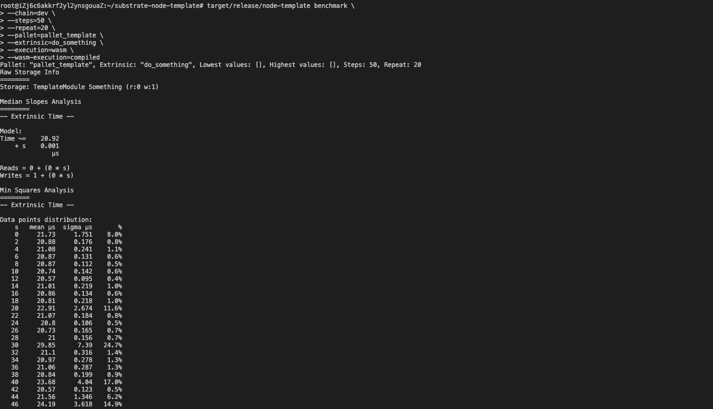
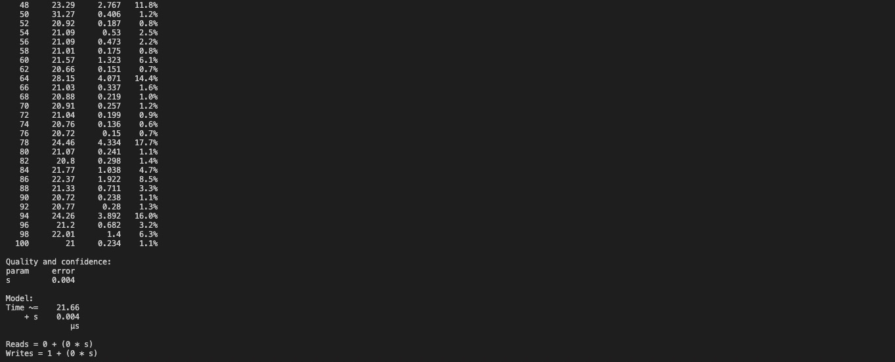
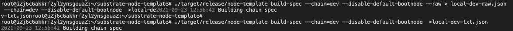

# 性能测试

```
cd node
cargo  build --features runtime-benchmarks --release

cd ..

target/release/node-template benchmark \
--chain=dev \
--steps=50 \
--repeat=20 \
--pallet=pallet_template \
--extrinsic=do_something \
--execution=wasm \
--wasm-execution=compiled
```



根据结果的毫秒数修改函数的权重(21us -> 21_000_000)
```
#[pallet::weight(21_000_000 + T::DbWeight::get().writes(1))]
pub fn do_something(origin: OriginFor<T>, something: u32) -> DispatchResult 
```

# 生成chain-spec文件

```
./target/release/node-template build-spec --chain=dev --disable-default-bootnode --raw > local-dev-raw.json

./target/release/node-template build-spec --chain=dev --disable-default-bootnode  >local-dev-txt.json

```
